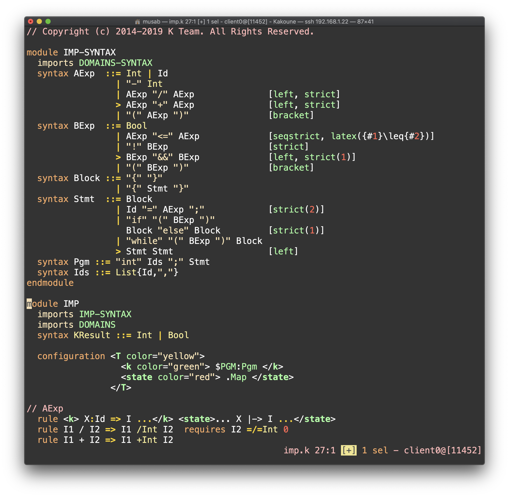
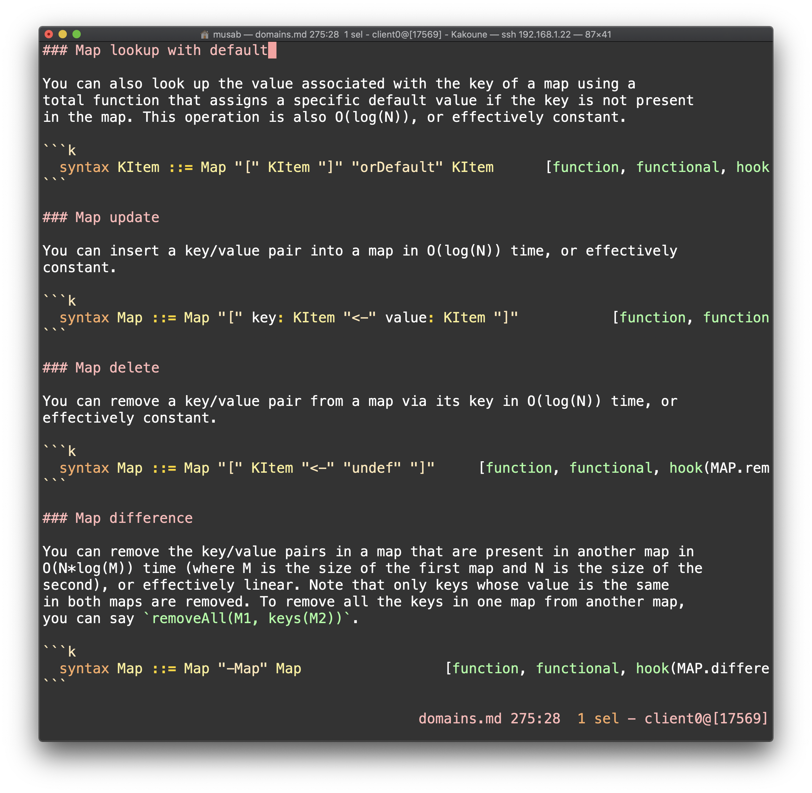

# k-kak

Basic syntax highlighting for K ([the K Framework](https://github.com/kframework/k))
in the [Kakoune text editor](https://kakoune.org).

## Overview

Syntax highlighting definitions are given in the file `k.kak`. The file  defines different highlighting
regions, including a region for K code (the default region), a region for string literals, a comments
region, and another region for K cell tags. Regions contain the various highlighers (keywords, builtin
operators, attributes ... etc). The definitiion also includes specification for automatic indentation
and automatic removal of trailing whitespaces, among other details. If you are interested to learn more,
see [this post](https://zork.net/~st/jottings/Intro_to_Kakoune_highlighters.html) for a
gentle introduction to defining kakoune highlighters and the official
[reference document](https://github.com/mawww/kakoune/blob/master/doc/pages/highlighters.asciidoc).
`k.kak` uses the same structure used in other definitions that come bundled with kakoune.

*Note: Syntax highlighting in `k.kak` does not attempt to be anywhere near perfect. It's more of a
"looks sensible" kind of highlighting. Having said that, I'd very much welcome suggestions
for improvement, so please feel free to raise issues or suggest changes through this Github repo.*

## Screenshot

This is a fragment from the the language imp (from the K tutorials
[here](https://github.com/kframework/k/blob/master/k-distribution/tutorial/1_k/2_imp/lesson_4/imp.k))
highlighted by `k-kak`:



## Installation

There are generally two options to install `k-kak`:

**Option 1:** Copy the file `k.kak` to your kakoune's directory of syntax highlighting definitions,
and kakoune will load it automatically. The exact location of this directory depends on your
system and how kakoune was installed. In my case (a Ubuntu machine with kakoune compiled from
source), that directory is `~/.local/share/kak/autoload/filetype`.

**Option 2:** If you don't want to mess with your kakoune's installation (or don't have write access
priviledges to where kakoune is installed), you may copy `k.kak` to the current user's kakoune
config directory located at `~/.config/kak/autoload`. You may create this directory if it doesn't
exist, and then copy `k.kak` there.

**Note:** If you are creating this directory `~/.config/kak/autoload`, kakoune will only load
the definitions listed in this new directory, unless the directory contains a symlink to the
system-wide `autoload` directory mentioned at Option 1 above (which in my case is
`~/.local/share/kak/autoload`). So, here are the steps in detail:

   1. create the user-level configuration directory, and change to it:

   ```sh
   mkdir ~/.config/kak/autoload
   cd ~/.config/kak/autoload
   ```

   2. Create a symlink inside this directory that points to the system-wide `autoload` folder. In my case, the command was:

   ```sh
   ln -s ~/.local/share/kak/autoload autoload
   ```

   3. Finally, copy over `k.kak` from this repo to the current directory. Kakoune will now load all the
      definitions that come bundled with it, along with our new addition `k.kak`.

## Pro Tip!

Kakoune's markdown syntax highlighting supports highlighting code snippets within code blocks, and
this includes external definitions like `k.kak`. To enable it, the only thing the you need to do is
add `k` to the list of languages supported by the markdown highlighter (assuming you have write
access to it), as follows:

1. Locate your system-wide syntax highlighting definitions bundled with kakoune (in my case, it's the
   directory `~/.local/share/kak/autoload/filetype`).

2. Open up the file `~/.local/share/kak/autoload/filetype/markdown.kak` for editing.

3. Look for the line defining a variable named `languages=...`. You will see it's a string of space-delimited
   list of languages supported. Just add `k` to this string and save your changes.

Below is screenshot of K definitions being highlighted inside various `k` code blocks in K's builtin
[domains.md](https://github.com/kframework/k/blob/master/k-distribution/include/kframework/builtin/domains.md)
file markdown file:



*Note: automatic removal of trailing whitespace does not seem to work inside markdown code blocks for some reason.*

## Feedback and Suggestions

Feel free to report problems by raising Github issues, or suggest improvements by making Github
pull requests.


