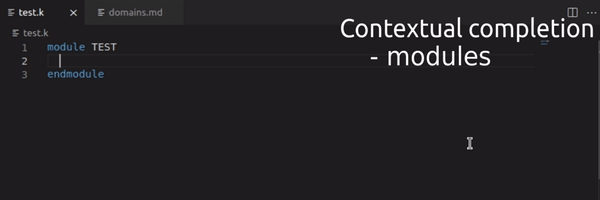
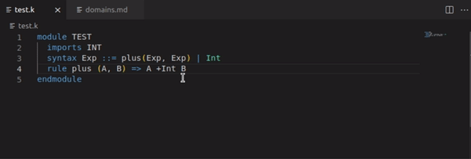
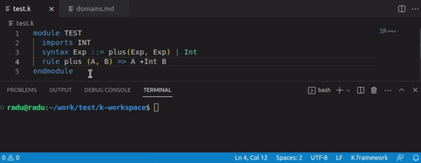
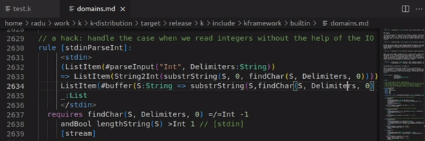

# K-syntax

K framework in VSCode.

The official extension maintained by Runtime Verification Inc.
and comunity contributors.

The K framework is an open source project and you can view the source code
here: https://github.com/runtimeverification/k

### Features

- Syntax highlighting for .k files and code blocks inside markdown files

- Integration with the `klsp` that provides support for code completion,
  limited diagnostics, go to definition, find references and selection range. Requires K v5.5.103 or higher.

- Code completion. Context sensitive: modules, sorts and syntax.

- Go to definition inside the workspace: requires, imports, syntax.

- Highlight syntax errors in the editor. The K framework output channel will
  contain diagnostic messages sent by the Language Server.

- Selection range. Increase and decrease the selection depending on the AST. Default keys: `Alt+Shift+LRArrows`

- Note: Some features require VSCode to be open in workspace mode, and
  have kompiled the definition to be able to access the AST caches. If
  the location information gets out of sync, you may need to clean and
  rekompile your definition.

- To enable `klsp` in Markdown you have to manually select the
  Language Mode in the bottom right. To make this the default behavior
  you can modify the Workspace Settings by adding
  `"files.associations": { "*.md": "kframework" }` in your `package.json`.

### Contribute

- Download this extension from https://github.com/runtimeverification/k-editor-support

- Import the `k-vscode` directory in VSCode

- Type `npm install` in the Terminal window to fetch the Node.js dependencies.

- Launch with `F5`

- For more details read `vsc-extension-quickstart.md`

- Special thanks to [Lucian Cumpata](https://github.com/LucianCumpata) and [Pumpk1n](https://github.com/PumpkinDemo)
  for their contributions on earlier versions of this extension.