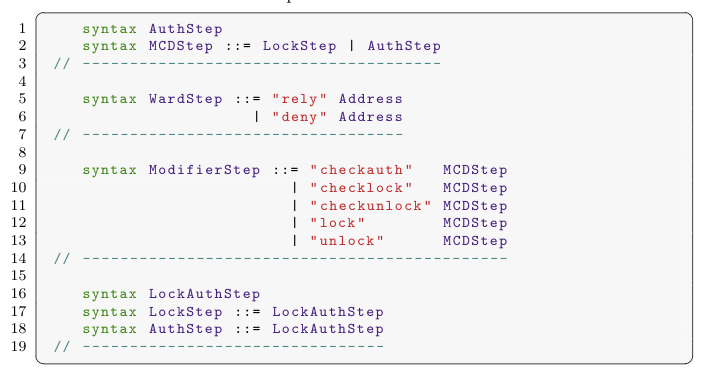

# Code highlighter for LaTeX

This highlighter was created based on the documentation around the LaTeX package lstlisting.

More documentation can be found here https://ftp.gwdg.de/pub/ctan/macros/latex/contrib/listings/listings.pdf. This highlighter is far from perfect and contributions are welcome.

## Usage

- Download the `k-highlighting.tex` file
- Add the file to your project
- Include it for usage in your project using:

```
\input{path-to-file/k-highlighting.tex}
```

- Use the highlighter as shown by the example below:

```
\begin{lstlisting}[language=K]
    syntax AuthStep
    syntax MCDStep ::= LockStep | AuthStep
 // --------------------------------------

    syntax WardStep ::= "rely" Address
                      | "deny" Address
 // ----------------------------------

    syntax ModifierStep ::= "checkauth"   MCDStep
                          | "checklock"   MCDStep
                          | "checkunlock" MCDStep
                          | "lock"        MCDStep
                          | "unlock"      MCDStep
 // ---------------------------------------------

    syntax LockAuthStep
    syntax LockStep ::= LockAuthStep
    syntax AuthStep ::= LockAuthStep
 // --------------------------------
\end{lstlisting}
```

which should give you this result:

